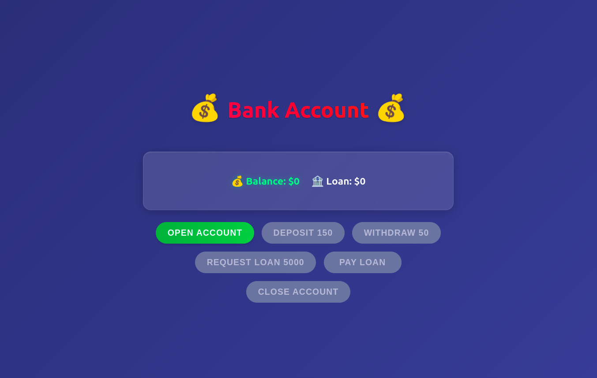

# 🏦 TinyBank

A lightweight and interactive bank account UI built with React and `useReducer`. Manage deposits, withdrawals, and loans with a smooth, modern interface.

## ✨ Features

-  🚀 Open and close a bank account
-  💰 Deposit and withdraw money
-  🏦 Request and repay loans
-  🎨 Stylish UI with animations
-  ⚛️ State management using `useReducer`
-  📱 Fully responsive design

## 🚀 Live Demo

[TinyBank Live](https://tiny-bank.vercel.app/)

## 📸 Preview

 (Replace with your actual screenshot)

## 🛠️ Technologies Used

-  ⚛️ React
-  🎨 CSS (with animations)
-  📦 useReducer for state management

## 🏗️ Installation

1. Clone the repository:
   ```sh
   git clone https://github.com/Abdalrahman-Amin/TinyBank.git
   ```
2. Navigate into the project folder:
   ```sh
   cd TinyBank
   ```
3. cd TinyBank:
   ```sh
   npm install
   ```
4. Start the development server:
   ```sh
   npm run dev
   ```

## 📌 Usage

-  Click "Open Account" to start banking.
-  Use the buttons to deposit, withdraw, or request a loan.
-  Repay loans and close the account when done.

## 📜 License

This project is open-source and available under the MIT License.

## 👨‍💻 Author

Abdalrahman Amin – https://github.com/Abdalrahman-Amin
